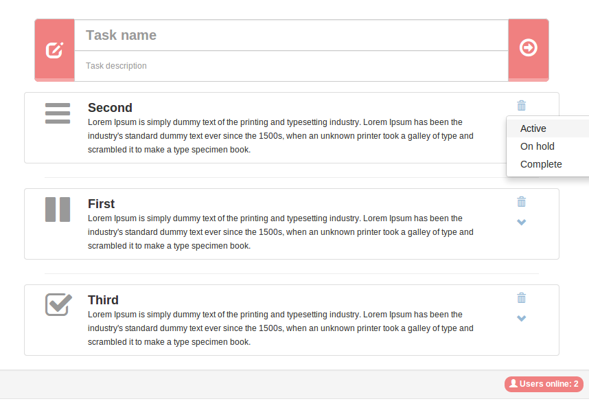

The meanest realtime task tracker
=============================
### You wouldn't like your app to be called "Todo app", right :) 

### Using:
Angular, SockJS, Primus, Express, Node, Mongoose

### Screenshot:

## Installation
 - install MongoDB and start it (on default port, 27017)
 - git clone this repo
 - `cd` to the project's root and fire:
   - `npm install`
   - `bower install`
   - `node server.js` starts the server 
 - then open [http://localhost:3000](http://localhost:3000) on couple of browser tabs (don't use IE)
 
## Still to do:
 - drag and drop tasks to reorder them (inside the category)
 - ~~enable task deletion~~
 - add label with task counter for each category (Active, On hold, Complete)
 
## Detailed post follows
I'll soon write a post describing, step by step, how to put this together from the ground up.
